# Ad Campaign Performance Analysis

A data analytics portfolio project analysing the performance of 2,446 digital advertising campaigns across 5 companies, 6 channels, and 5 campaign types. The goal is to uncover actionable insights that help businesses optimise their advertising strategy and maximise ROI.

---

## Tools Used
- **MySQL** — data analysis & querying
- **Power BI** — dashboard & visualisation *(in progress)*
- **Excel** — initial data exploration

## Dataset
**Marketing Campaign Performance Dataset** — sourced from [Kaggle](https://www.kaggle.com/datasets/manishabhatt22/marketing-campaign-performance-dataset)

- 20,000 rows, 16 columns
- Covers campaigns from 2021 across 5 US cities
- Key metrics: ROI, Conversion Rate, Clicks, Impressions, Engagement Score, Acquisition Cost

---

## Key Findings

### Overall Performance
| Metric | Value |
|---|---|
| Total Campaigns | 2,446 |
| Total Companies | 5 |
| Average ROI | 5.07 |
| Average Conversion Rate | 8.05% |
| Total Clicks | 1,337,472 |
| Total Impressions | 13,495,198 |
| Overall CTR | 9.91% |
| Average Engagement Score | 5.45 |

### 📢 Channel Performance
Facebook is the top performing channel with an average ROI of **5.16**, followed closely by Google Ads at **5.15**. Website has the lowest average ROI at **4.97**.

| Channel | Avg ROI | Avg Conversion Rate | CTR |
|---|---|---|---|
| Facebook | 5.16 | 7.91% | 10.41% |
| Google Ads | 5.15 | 8.69% | 9.71% |
| YouTube | 5.08 | 7.82% | 9.86% |
| Instagram | 5.05 | 7.93% | 10.10% |
| Email | 4.99 | 8.04% | 9.72% |
| Website | 4.97 | 7.95% | 9.68% |

### 🎯 Campaign Type Performance
Social Media campaigns lead on ROI (**5.18**), while Email campaigns have the highest conversion rate (**8.23%**).

### 👥 Audience Segmentation
Women 35-44 have the highest conversion rate at **8.22%**, while Men 18-24 follow closely at **8.09%**. Women 25-34 have the lowest at **8.00%**.

### 🛍️ Customer Segments
Foodies have the highest conversion rate (**8.36%**) while Outdoor Adventurers lead on ROI (**5.11**).

### 📍 Location Performance
New York and Los Angeles tie for the highest ROI (**5.08**), while Chicago leads on conversion rate (**8.25%**).

### ⏱️ Campaign Duration
Longer campaigns (60 days) yield the highest ROI (**5.08**) but shorter campaigns (30 days) have the highest conversion rate (**8.21%**), suggesting a trade-off between brand awareness and direct response.

### 🏆 Company Leaderboard
Alpha Innovations leads with an average ROI of **5.18**, while DataTech Solutions has the lowest at **4.86**.

### 💰 Cost Efficiency
The most cost-efficient campaign (Campaign #2139, Alpha Innovations — Email on Facebook) achieved an ROI of **7.95** with an acquisition cost of only **$5,091**, yielding **1.56 ROI per $1,000 spent**.

### 📅 Monthly Trend
ROI remained relatively stable throughout 2021 (ranging from 4.98 to 5.18), with a notable peak in **May 2021** at **5.18**. Conversion rates fluctuated more, peaking in **March** at **8.37%**.

---

## SQL Queries & Results

### Query 1 — Overall Campaign Performance
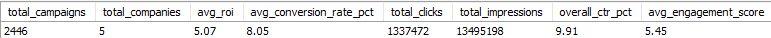

### Query 2 — Channel Performance
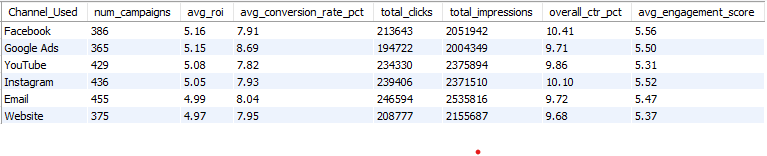

### Query 3 — Campaign Type Performance
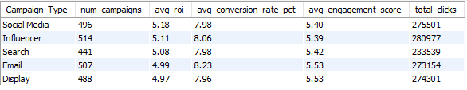

### Query 4 — Audience Segmentation
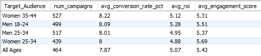

### Query 5 — Customer Segment Performance
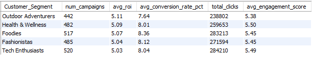

### Query 6 — Location Performance
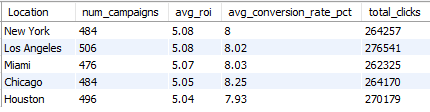

### Query 7 — Cost Efficiency
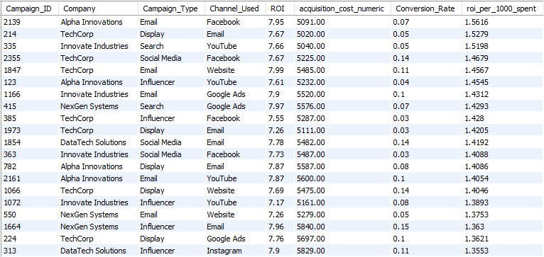

### Query 8 — Campaign Duration Impact
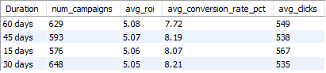

### Query 9 — Company Leaderboard
Top 5

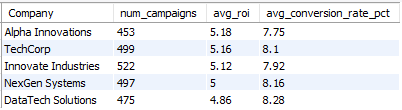

Bottom 5

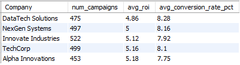

### Query 10 — Monthly Trend
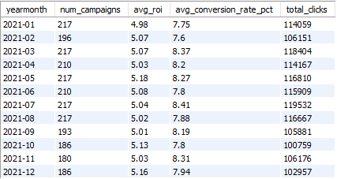

### Query 11 — Best Channel per Campaign Type
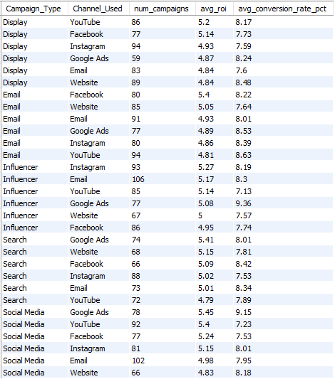

### Query 12 — High Value Campaigns

---

## Strategic Recommendations

Based on the analysis, a data-driven advertiser should consider the following:

1. **Prioritise Facebook and Google Ads** - Consistently highest ROI across campaign types
2. **Target Women 35-44 and Men 18-24** - Highest conversion rates across all audiences
3. **Use Social Media for brand awareness** - Highest ROI among campaign types
4. **Use Email for direct conversions** - Highest conversion rate among campaign types
5. **Focus budget on New York and Los Angeles** - Consistently strong performance across metrics
6. **Run longer campaigns for ROI, shorter for conversions** - 60-day campaigns maximise ROI while 30-day campaigns drive higher conversion rates

---

## Notes
- `Date` is a reserved word in MySQL and requires backticks when used as a column name
- `Acquisition_Cost` is stored as formatted currency (e.g. `$16,174.00`) and requires cleaning before numeric calculations
- All queries written and tested in **MySQL Workbench**

## Status
🚧 Power BI dashboard in progress
